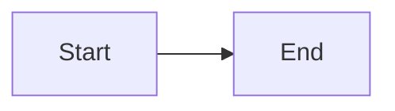

# Click-Zoom Test Page

## Mermaid Diagram

```mermaid
graph LR
    A[Start] --> B[End]
```

## Inline SVG

<svg width="100" height="100" xmlns="http://www.w3.org/2000/svg">
  <circle cx="50" cy="50" r="40" fill="blue" />
</svg>

## SVG Image

